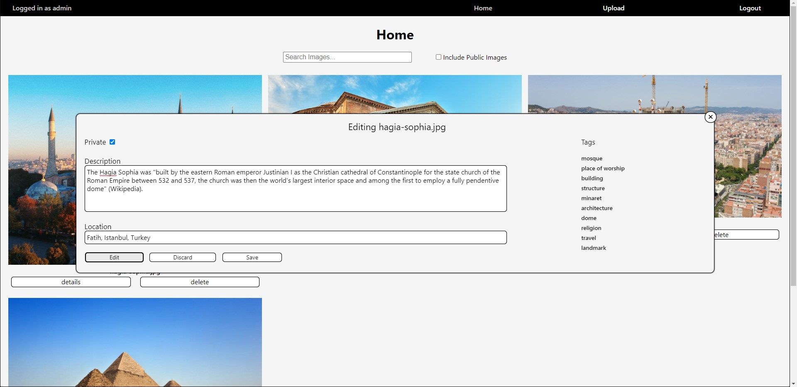

# Image Repository

## Install Dependencies
This application requires Go 1.15 and Yarn (alternatively npm) to be installed. The backend uses Go Modules. In order to install dependencies used by the backend, run `go mod download` in the `/backend` directory. The frontend is a React project. Run `yarn install` (or `npm install`) in the `/frontend` directory to install dependencies used by the frontend.

## How to Use
### Deploy the Backend
To deploy the backend, run `go run main.go` in the `/backend` directory.
### Launch the Frontend
To launch the frontend, run `yarn start` (or `npm run`) in the `/frontend` directory. Open [http://localhost:3000](http://localhost:3000) to view it in the browser.
### Create an Account
The image repository has user authentication and authorization. To begin, open the frontend in the browser and click 'Create Account'. Submit your credentials to create a new account and go to the home page.
### Upload Some Images
From the home page, click 'Upload' in the navbar to upload some images to your repository. Click 'Choose Images' to browse and select one or more images from your computer. You will see a preview of the images you select. Before uploading, you can add some details about these images. Click 'details' below the image preview, and then click 'Edit' in popup modal to edit the image information. You can add a description and location to the image, and if you want the image to be visible to other users, you can deselect the 'Private' checkbox to make the image publicly visible. Click 'Save' when done making changes before closing the modal. Finally, click the 'Upload' button to upload your images to the repository backend.
### Search and View Images
On the home screen, you can view and search your images. The search will compare your query string to image description, location, as well as a list of generated tags that categorize the image. Optionally, you can include public images (that are not yours) in your search query. To search for a large number of images, you can use a comma-separated list of words in your query, which will search for images with at least one tag matching one of the words you list.

## Features
- upload one image
- upload multiple images
- delete images
- search for images from text (description and location)
- search for images by classification (AI-generated image tags)
- JWT authorization implementation
- image visibility (public or private)
- access control
- user account creation

## Technologies
The frontend is built with React. The backend is written in Go using the gin-gonic web framework. The application uses an SQLite database, and the backend uses GORM to query the database. Image files are stored in the filesystem.

## Areas for Improvement
- The SQLite database is convenient for a demo since it is self-contained in the `gorm.io/driver/sqlite` package. For a scalable database with better concurrency control, a MySQL or PostgreSQL database should be used.
- The Imagga API key and secret are stored in `backend/.env` to make this repository self contained, however they should be kept a secret.

## Screenshots
### Upload Images

### Home Page

### Search Images

